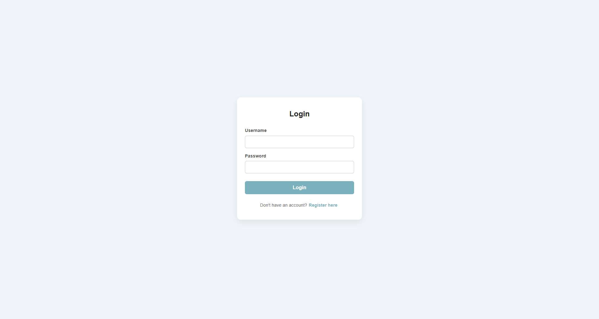

<div>
<h1> 🔥 Simple Login Page Using React </h1>

<p><b>
A minimal full-stack application built to verify that a React development environment is functioning correctly.
The project features a React front-end and a Spring Boot back-end responsible for validating user credentials.
</b></p>
<br />
<p>User information is stored in a MySQL database configured using the XAMPP phpMyAdmin panel.</p>

<h4>
   <a href="#-features">Features</a> •
   <a href="#️-tech-stack">Tech Stack</a> •
   <a href="#️-setup">Setup</a> •
   <a href="#-purpose">Purpose</a>
</h4>
</div>

<br />

## 🪶 Features

* React-based login interface
* Spring Boot REST API for user authentication
* MySQL database for storing user data
* Basic username/password validation

## ⚙️ Tech Stack

* Front-end: React
* Back-end: Spring Boot
* Database: MySQL (XAMPP-phpMyAdmin)

## 🛠️ Setup

Create a database using phpMyAdmin panel:
```sql
CREATE DATABASE login_db;
```

Create a table:
```sql
CREATE TABLE users (
    id BIGINT AUTO_INCREMENT PRIMARY KEY,
    username VARCHAR(255) NOT NULL,
    password VARCHAR(255) NOT NULL
);
```

Initiate Spring Boot:
```bash
./mvnw spring-boot:run
```

Initiate front-end:
```bash
npm run dev
```

## ✨ Purpose

This project serves as a testing environment to verify proper integration between the client, server, and database layers during development.

## 📷 Preview

<p align="center">

</p>